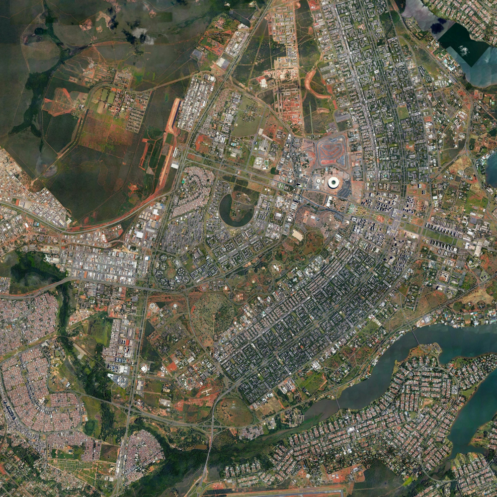
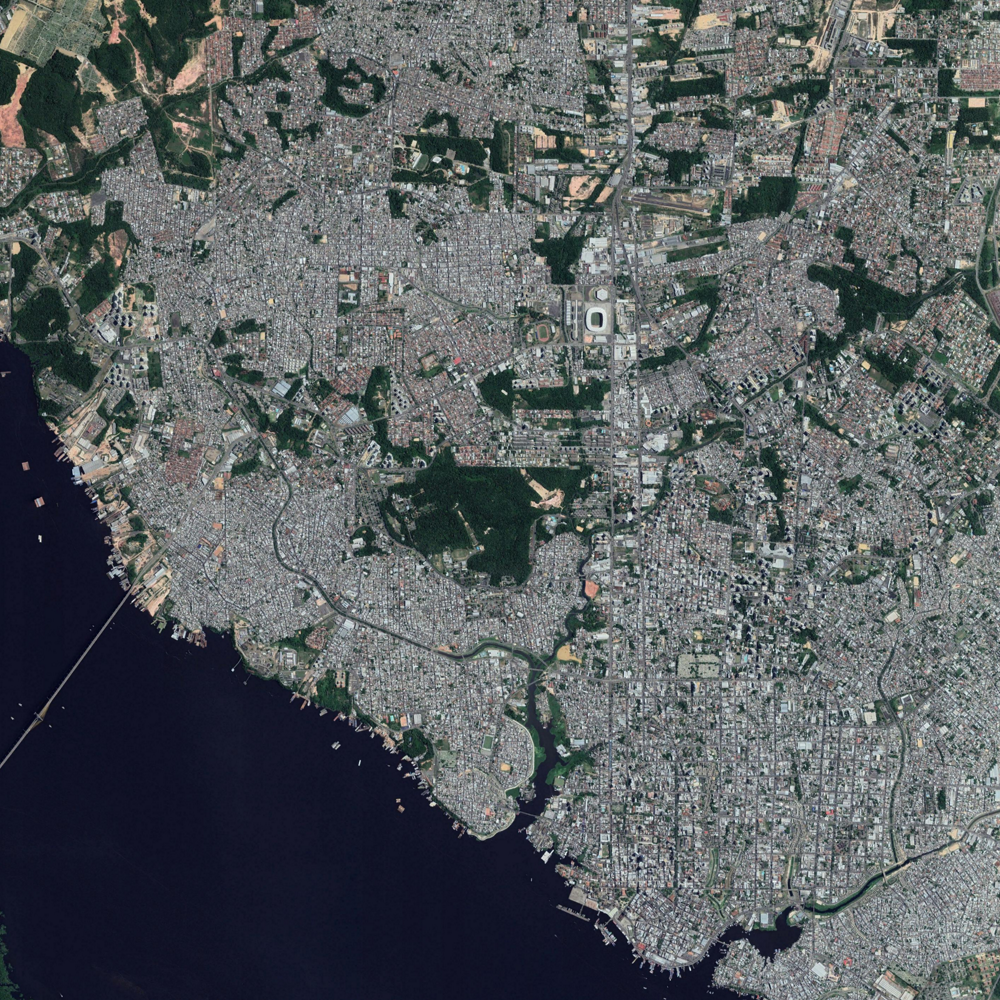
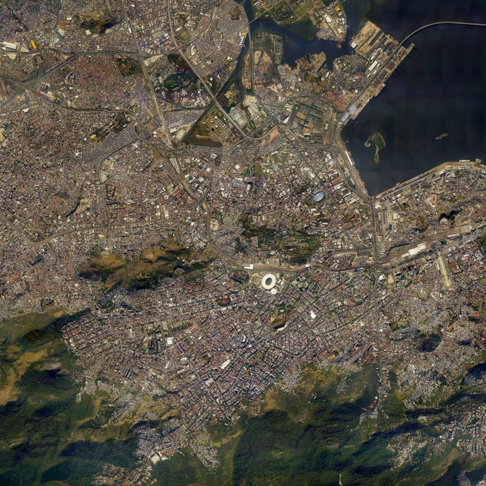
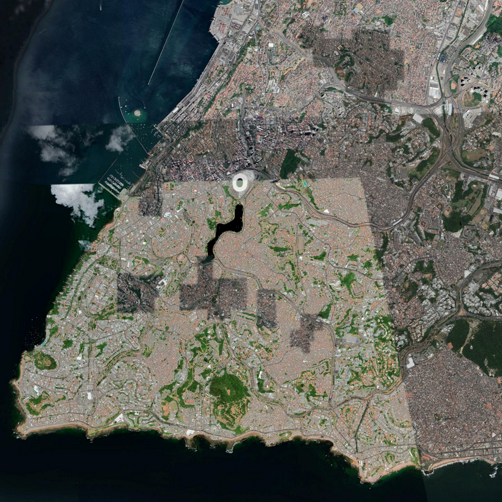
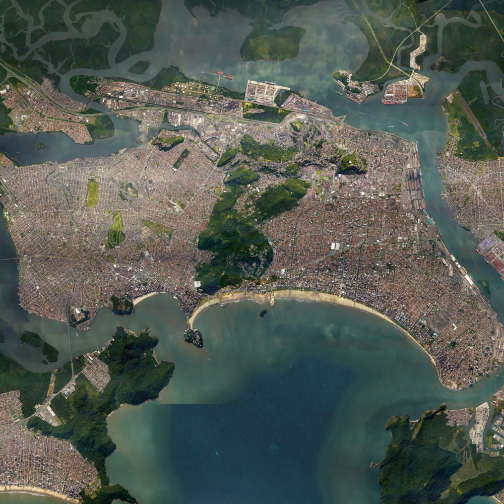
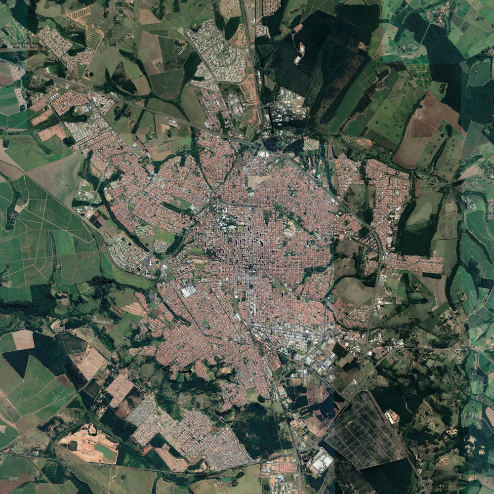
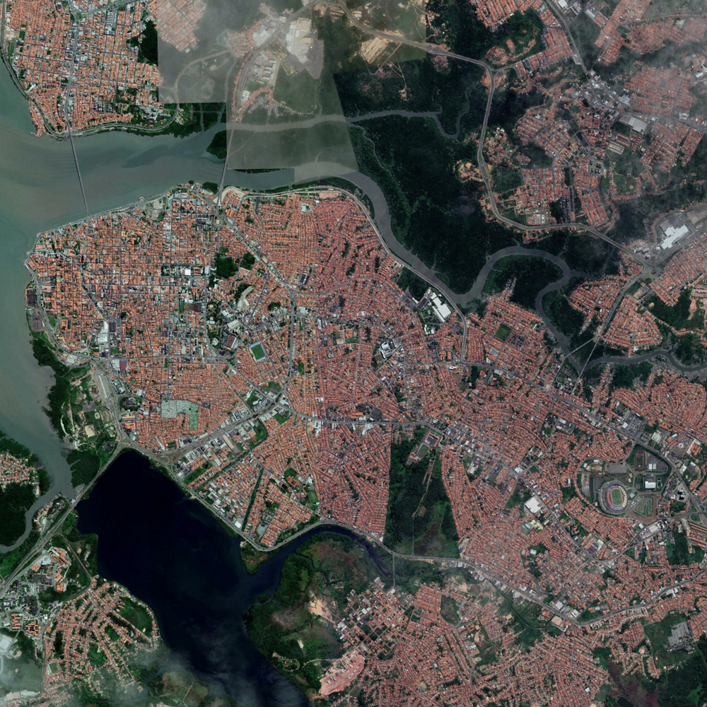
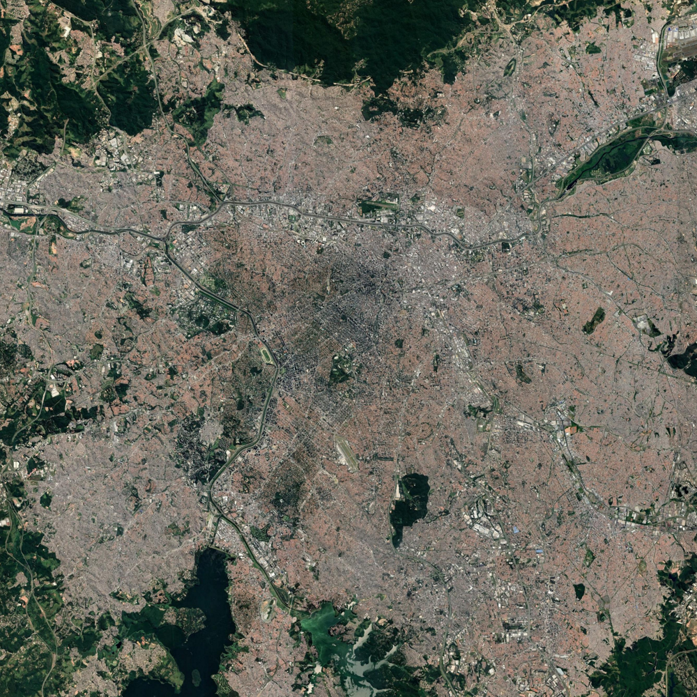

# Urban-Density-Mapping
Urban density heat maps extraction from Google Maps Aerial Images.
This is the final project for the Digital Image Processing course, 2019/1.
___

### Objective
This project proposes spatial analisys of urban areas given aerial images, with focus on building and populational density. The main goal is to extract heat maps that describe urban density and provide data for geospatial studies.

### Images and data
The images to be used on the project are brazilian cities snapshots from the [Google Earth plataform](https://www.google.com/earth/). While satelite data is more robust and would make results more precise (greater resolution,more light wavelenght bands), Google Earth images are used for the sake of simplicity.

The images are: 

| Brasilia| Manaus | Rio de Janeiro | Salvador |
|:-------------------------:|:-------------------------:|:-------------------------:|:-------------------------:|
|  | | |  | 
| **Santos** | **Sao Carlos** | **Sao Luis** | **Sao Paulo** |
|  |  |  |  | 

| City           | Population | Area(km^2) | filename         | Pixel/km | 
|----------------|------------|------------|------------------|------------| 
| Brasilia       | 2947703    | 5760.783   | brasilia.png     | 70         | 
| Manaus         | 2145444    | 11401.092  | manaus.png       | 99         | 
| Rio de Janeiro | 6688927    | 1200.255   | riodejaneiro.png | 105        | 
| Salvador       | 2857329    | 693.831    | salvador.png     | 140        | 
| Santos         | 432957     | 281.033    | santos.png       | 77         | 
| Sao Carlos     | 249415     | 1136.907   | saocarlos.png    | 77         | 
| Sao Luis       | 1094667    | 582.974    | saoluis.png      | 154        | 
| Sao Paulo      | 12176866   | 1521.11    | saopaulo.png     | 69         | 

The data on the cities was found on [IBGEpopulacao](https://agenciadenoticias.ibge.gov.br/agencia-detalhe-de-midia.html?view=mediaibge&catid=2103&id=2279) and [IBGEArea](https://www.ibge.gov.br/geociencias/organizacao-do-territorio/estrutura-territorial/2225-np-areas-dos-municipios/15761-areas-dos-municipios.html?t=downloads&c=3548906), and the image data was taken from Google Earth. 

### Methods
Inspired by [Ponti, 2013](http://conteudo.icmc.usp.br/pessoas/moacir/papers/Ponti_GRSL2013.pdf) and the contents of Digital Image Processing class materials, image processing techniques such as Vegetation indices,Texture detection, Thresholding and pixel intensity histograms.

The methods of vegetation indices (such as Visual Vegetation Index) are used for increasing the contrast betwen forest areas and building areas using ratios of color channels to alter the image. Similar ratios could be used to set the land apart from water. Empty land is more tricky to differentiate by color, histogram comparisson tries to capture the noise in urban dense areas. We can then arbitrarely determine category in which is possible to classify the density tiers by how much the rest of the image compares to the reference urban dense area. The resulting image is used to colorize the original one, so the color is stronger where the urban density is greater.

### Aplication
Designed to aid spatial epidemiology projects, but useful to other geospatial studies, police-making and public interests.

### Reports
[Partial Report](https://github.com/ericrib/Urban-Density-Mapping/blob/master/partial.ipynb)
[Improved partial](https://github.com/ericrib/Urban-Density-Mapping/blob/master/partial_improved.ipynb)
[Final Report](https://github.com/ericrib/Urban-Density-Mapping/blob/master/Final_Report.ipynb)
